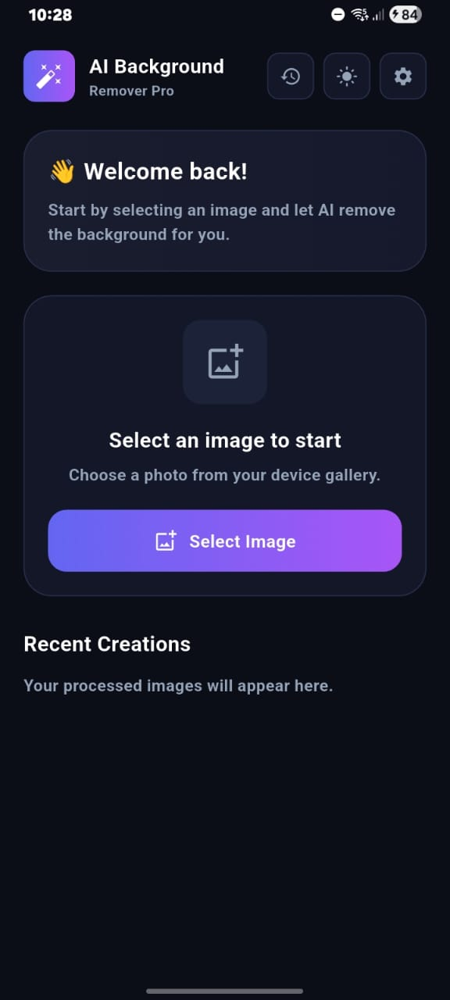
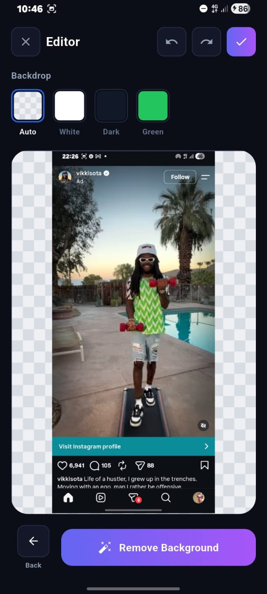
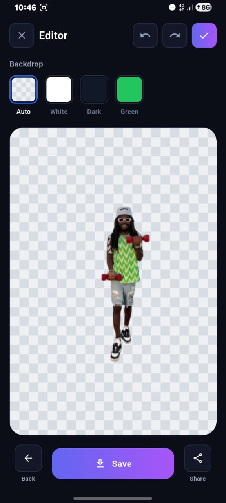
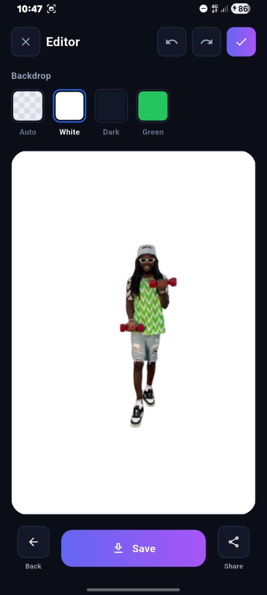
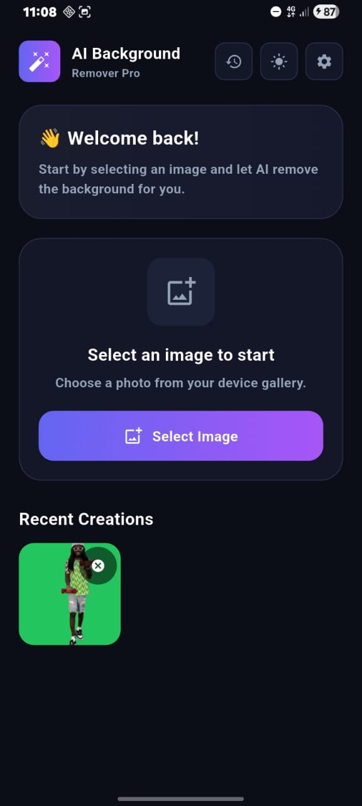

# Background Remover

A Flutter mobile application for removing image backgrounds, previewing the result against different backdrops, and saving or sharing the finished image.

Background Remover uses the Remove.bg API to process images. After processing, you can preview the transparent result, choose a backdrop for viewing, and export the image with your selected background.

## Features

* **Background removal:** Process a selected image using the Remove.bg API.
* **Image preview and editing:** Open the processed image in the editor.
* **Backdrop selection:** Preview the result against a checkerboard transparency pattern, white, dark, or green backdrop.
* **PNG export:** Save the image with the selected backdrop composited into the exported image.
* **Image sharing:** Share the exported image.
* **Recent Creations:** View previously completed creations from the home screen.
* **Local persistence:** Keep recent creations available after closing and reopening the app.
* **Editable recent creations:** Reopen a creation, change its backdrop, and save the update without creating a duplicate recent entry.
* **Launcher icon:** Custom application icon.

## Screenshots

### Home Screen


### Selected Image Preview


### Transparent Background Preview


### Backdrop Selection


### Recent Creations


## Technology Stack

* **Flutter** and **Dart** for cross-platform mobile development
* **Remove.bg API** for image background removal
* **image_picker** for selecting images from the device gallery
* **path_provider** for accessing app-specific local storage
* **flutter_dotenv** for loading API configuration from an environment file
* **flutter_launcher_icons** for generating launcher icons

## Requirements

Before running the project, install:

* Flutter SDK
* Dart SDK compatible with the project's Flutter version
* Android Studio or another configured Android development environment
* A Remove.bg API key

Check your Flutter setup:

```bash
flutter doctor
```

## Getting Started

### 1. Clone the repository

```bash
git clone <YOUR_REPOSITORY_URL>
cd <YOUR_PROJECT_DIRECTORY>
```

Replace the placeholders with the actual GitHub repository URL and directory name.

### 2. Install dependencies

```bash
flutter pub get
```

### 3. Configure the API key

Create the `.env` file expected by the project and add your Remove.bg API key using the variable name read by the background-removal service.

For example, if the service reads `REMOVE_BG_API_KEY`:

```dotenv
REMOVE_BG_API_KEY=your_api_key_here
```

Obtain an API key through the official [Remove.bg website](https://www.remove.bg/).

**Security:** Do not commit your real `.env` file or expose your API key in screenshots, source code, or public repositories. Confirm that `.env` is excluded by `.gitignore`. If a separate environment example file is added, use a placeholder value only.

### 4. Run the application

Connect a supported device or start an emulator, then run:

```bash
flutter run
```

## Using the App

1. Open Background Remover.
2. Select an image from the device gallery.
3. Open the editor and run background removal.
4. Choose a preview backdrop: checkerboard, white, dark, or green.
5. Save or share the image when you're satisfied with the result.
6. Select **Done** to return to the home screen and add the result to Recent Creations.
7. Reopen a recent creation to change its backdrop or export it again.

The backdrop selected in the editor is used when creating the exported image. The recent creation also retains the transparent processed image so you can choose a different backdrop later.

## Local Data and Storage

Recent Creations are stored locally in the application's documents directory. The stored data includes the processed image, its preview image, and the selected backdrop.

This allows recent creations to persist between app launches without requiring an account or remote gallery.

Local app data may be removed if the application is uninstalled or its data is cleared. The Recent Creations list is separate from images previously exported to the device gallery.

## Building a Release APK

To build a release APK locally:

```bash
flutter build apk --release
```

The generated APK is located at:

```text
build/app/outputs/flutter-apk/app-release.apk
```

For published builds, use the APK attached to the corresponding GitHub Release.

## Project Configuration

* Keep API credentials in the local environment file.
* Do not commit generated secrets or private credentials.
* Run static analysis before committing:

```bash
flutter analyze
```

* Run the project's tests:

```bash
flutter test
```

## Known Limitations

* Background removal requires network access and a valid Remove.bg API key.
* API usage, availability, and processing limits depend on the Remove.bg account and service.
* Recent Creations are stored on the device rather than synchronized between devices.
* Exported images use the currently selected backdrop; the app retains the transparent processed image separately for future editing.

## License

No license has been specified yet. Unless a license is added to this repository, reuse and redistribution are not expressly granted.
